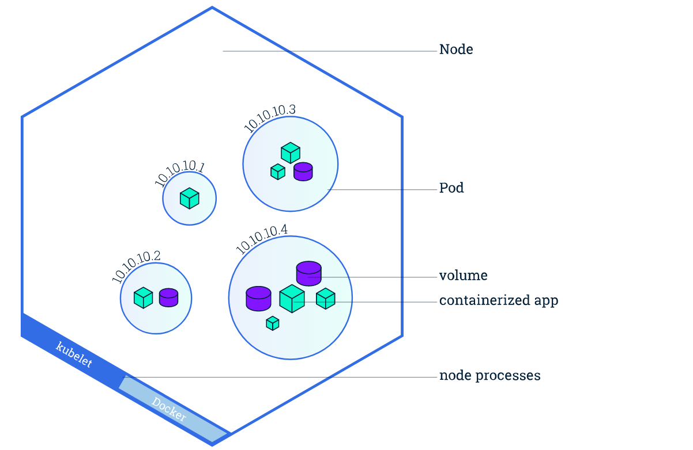
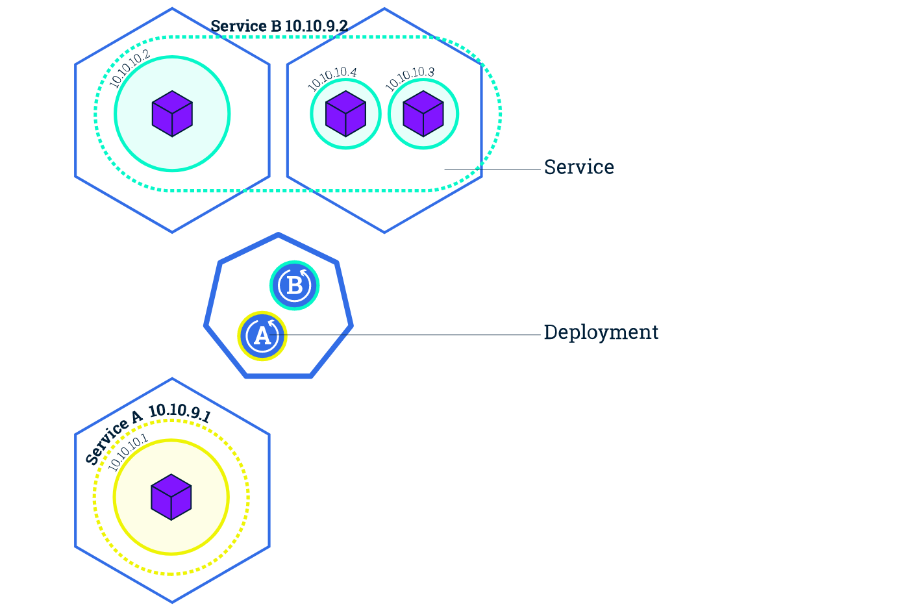
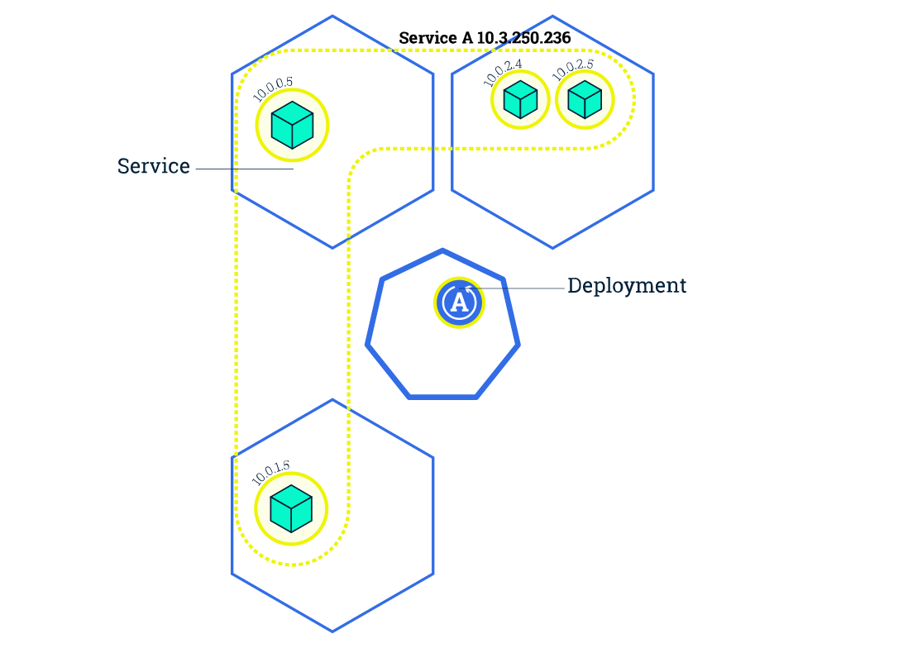
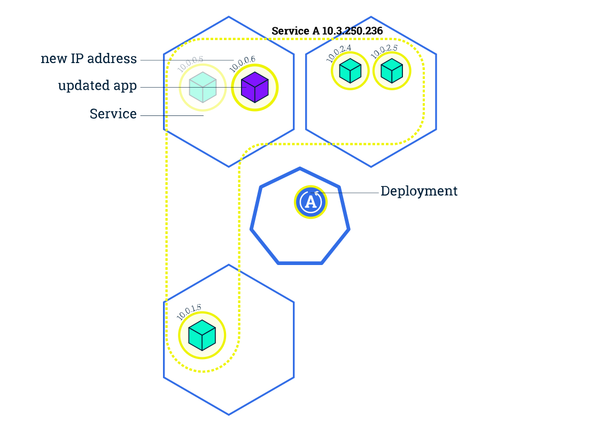
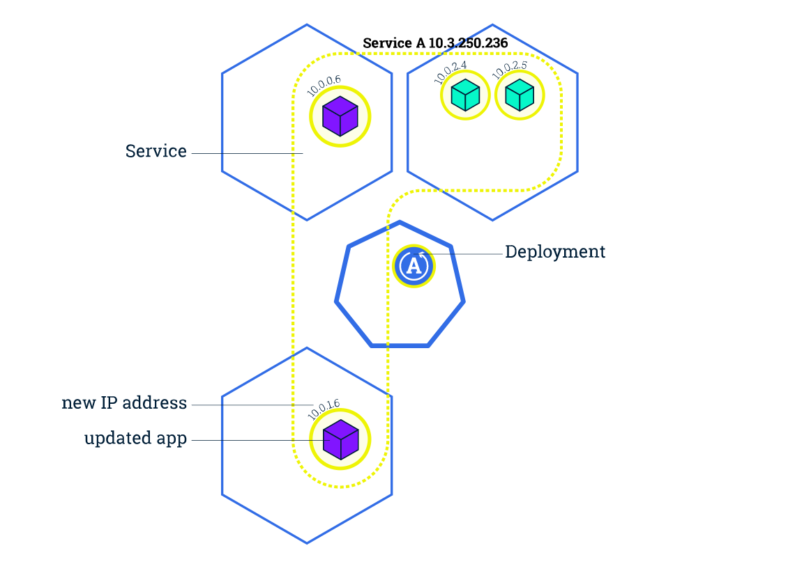

#  Kubernetes 101
-
### Deploying Your First Cloud Native Application
<!-- .slide: data-background="krakow2016.JPG" -->
-
##### Catalin Jora | Container Solutions | @jocatalin 
-
###### Atmosphere Conf Krakow | 16 May 2017 

---

### Who Am I

Catalin Jora (Engineer @ Container Solutions)  
@jocatalin    

---

## Kubernetes 101
  
Why:  cloud native applications  

What: the building blocks  

How:  deploying application (demo)    

---

## Why Kubernetes  

defining cloud native applications  
<!-- .element: class="fragment" data-fragment-index="1" -->

Note: DevOps movement is a side-effect of this.

---

## Software Capabilities Wish List 2017

Speed  

Scale  

Costs  

---

## Speed of release  

Release cycle of software will only acelerate, will (probably) never slow down. 

Note: DevOps movement is a side-effect of this.

---

## Scale 

Software should be able to grow with user/business demand

---

## Costs

Reduce infrastructure costs by moving from pay in advance to pay per use

---

### Cloud Native Systems
> distributed systems environments capable of scaling to tens of thousands of self healing multi-tenant nodes | [cncf](cncf.io)

---

### Cloud Native Applications

Packed in containers
<!-- .element: class="fragment" data-fragment-index="1" -->

Dinamically managed  
<!-- .element: class="fragment" data-fragment-index="2" -->

Micro-service oriented 
<!-- .element: class="fragment" data-fragment-index="3" -->

---

## What is Kubernetes
Kubernetes is a production-grade, open-source platform that orchestrates the placement (scheduling) and execution of application containers within and across computer clusters.
<!-- .element: class="fragment" data-fragment-index="1" -->

---

## Kubernetes can run on

laptop  

public cloud  

on-premises  

Note: my demo will run on the laptop version, called minikube

---

## How to run Kubernetes

vanilla (you will do the maintenance)  

managed (as a service)   

---

## Kubernetes Architecture

Note: Cluster is composed out of master and nodes. Nodes run the apps. Master is in charge of scheduling apps.

---

## Kubernetes Architecture

#### master  
etcd, API server, controller manager, scheduler, kubelet  

#### nodes 
kubelet, docker

---

## Kubernetes Deployment

* responsible for creating and updating the instances of your applications  

* provide a self-healing mechanism

---

## Kubernetes Deployment

---

## Kubernetes Pod

* a group of one or more containers (e.g. Docker)
* shared storage & unique cluster level IP
* info about container image, ports, resources (CPU,RAM)

---

## Kubernetes Pod

* are mortal
* are the atomic unit on Kubernetes
* deployments are creating pods with containers inside them

---

## Kubernetes Pod

---

## Kubernetes Node

---

## Kubernetes Service
-
##### abstraction layer which defines a logical set of Pods  

* enables external traffic exposure

* load balancing 

* service discovery for pods

---

---

### Kubernetes Label

* key/value pairs attached to objects (E.g Pods)

* help organizing objects

* can be changed anytime

---

---

### Scalling Applications
-
##### Changing the number of replicas in a deployment

* traffic is sent only to up & running pods

* new pods are created on nodes with available resources

* running multiple pod replicas allow zero-downtime updates

---

---

---

### Rolling Updates

-

##### Incremental pods update for deployments  

* CI/CD with zero downtime

---

---

---

---

## How to deploy on Kubernetes (demo)

---

## Learn Kubernetes

* Beginer:  https://katacoda.com/courses/kubernetes  
 
* Advanced: https://github.com/kelseyhightower/kubernetes-the-hard-way

---

### Take Aways Kubernetes

- Works only with containers

- Scales your app in line with the demand

- Make inteligent use of available resources

- Deploys apps with zero-downtime

---

### Thanks!

>Questions?
